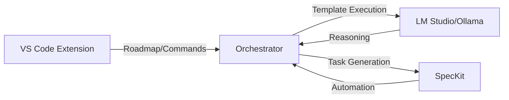

# Orchestrator

A Node.js orchestration server that bridges VS Code, SpecKit, and LM Studio/Ollama for automated software development workflows.

## Project Overview



The orchestrator server enables automated software development by:
1. Converting roadmap items into SpecKit tasks
2. Executing templates with LLM-powered reasoning
3. Automating development tasks through VS Code commands

## Prerequisites

- Node.js 18+
- LM Studio or Ollama for local LLM execution
- VS Code with orchestrator extension
- `npm` for dependency management

## Quick Start

1. Install dependencies and build:
```bash
npm install
npm run build
```

2. Start LM Studio (or preferred provider) and orchestrator:
```bash
npm run start:orchestrator
```

3. Install VS Code extension:
- Via packaged .vsix file
- Or using `vsce package` and manual installation

4. In VS Code:
- Generate roadmap.json
- Convert to SpecKit tasks
- Run templates/automation phases

## Development

```bash
# Start orchestrator server
npm run start:orchestrator

# Run tests
npm run test:server    # Test orchestrator server
npm run test:extension # Test VS Code extension
```

See [Usage Guide](docs/orchestrator-usage.md) for detailed command reference and troubleshooting.

## Environment Variables

| Variable | Default | Description |
|----------|---------|-------------|
| `ORCH_PORT` | 4100 | Orchestrator HTTP port |
| `ORCH_MODEL` | lmstudio-local | Model ID for LLM calls |
| `OPENAI_API_BASE` | http://localhost:1234/v1 | LM Studio API base URL |
| `DESKTOP_DRIVER_URL` | http://127.0.0.1:39990/computer-use | Desktop driver endpoint |
| `MAX_STEPS` | 8 | Maximum steps per task |
| `ORCH_ADMIN_TOKEN` | (empty) | If set, protects `/admin/*` endpoints |
